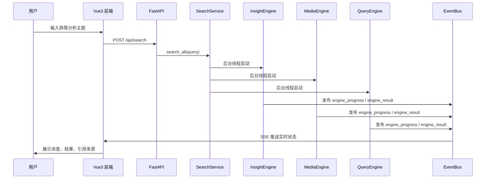

https://github.com/user-attachments/assets/0fb89878-6f82-4977-aae9-2d8f6f558396


# 舆情分析系统

基于多引擎协同的智能舆情分析系统，支持热点追踪、深度研究、报告生成等全流程功能。

## 一、功能特性

- **多引擎架构**：Insight（洞察）、Media（媒体）、Query（查询）、Forum（论坛）、Report（报告）五大引擎
- **AI 驱动**：集成 DeepSeek、Kimi、Gemini 等多种 LLM
- **情感分析**：内置多语言情感分析模型
- **自动报告生成**：支持 HTML/PDF/MD 多格式导出
- **实时监控**：SSE 实时事件流 + 轮询状态更新

---

## 二、快速开始

#### 1. 修改配置

```bash
# 复制配置文件模板
cp .env.example .env
```

编辑 `.env` 文件，填写以下关键配置：

```bash
# 数据库配置
DB_HOST=localhost          
DB_PORT=3307   # 宿主机端口改为 3307，避免与本地 MySQL 3306 冲突
DB_USER=root
DB_PASSWORD=你的密码
DB_NAME=media_crawler

# LLM API 配置（以硅基流动为例）
INSIGHT_ENGINE_API_KEY=sk-xxxxx
INSIGHT_ENGINE_BASE_URL=https://api.siliconflow.cn/v1
INSIGHT_ENGINE_MODEL_NAME=deepseek-ai/DeepSeek-V4-Flash

MEDIA_ENGINE_API_KEY=sk-xxxxx
MEDIA_ENGINE_BASE_URL=https://api.siliconflow.cn/v1
MEDIA_ENGINE_MODEL_NAME=deepseek-ai/DeepSeek-V4-Flash

QUERY_ENGINE_API_KEY=sk-xxxxx
QUERY_ENGINE_BASE_URL=https://api.siliconflow.cn/v1
QUERY_ENGINE_MODEL_NAME=deepseek-ai/DeepSeek-V4-Flash

REPORT_ENGINE_API_KEY=sk-xxxxx
REPORT_ENGINE_BASE_URL=https://api.siliconflow.cn/v1
REPORT_ENGINE_MODEL_NAME=deepseek-ai/DeepSeek-V4-Flash

FORUM_HOST_API_KEY=sk-xxxxx
FORUM_HOST_BASE_URL=https://api.siliconflow.cn/v1
FORUM_HOST_MODEL_NAME=deepseek-ai/DeepSeek-V4-Flash

# 搜索工具配置
TAVILY_API_KEY=tvly-xxxxx      # 申请地址：https://www.tavily.com/
ANSPIRE_API_KEY=sk-xxxxx       # 可选：Anspire AI Search
```

> **提示**：所有 Engine 可使用相同的 API Key 和 Base URL，也可分别配置不同服务商。

#### 2.下载 Insight 引擎所需模型

通过魔搭社区下载

情感分析模型：tabularisai/multilingual-sentiment-analysis

聚类模型：sentence-transformers/paraphrase-multilingual-MiniLM-L12-v2

```bash
# 在项目根目录执行
python download_models.py
```

下载完成后，在 `.env` 中配置模型绝对路径：

```bash
# Windows 示例
SENTIMENT_MODEL_NAME=D:\projects\sentiment_analysis_platform\engines\InsightEngine\models\multilingual-sentiment-analysis
CLUSTERING_MODEL_NAME=D:\projects\sentiment_analysis_platform\engines\InsightEngine\models\paraphrase-multilingual-MiniLM-L12-v2

# Linux/macOS 示例
SENTIMENT_MODEL_NAME=/home/user/projects/sentiment_analysis_platform/engines/InsightEngine/models/multilingual-sentiment-analysis
CLUSTERING_MODEL_NAME=/home/user/projects/sentiment_analysis_platform/engines/InsightEngine/models/paraphrase-multilingual-MiniLM-L12-v2
```

### 方式一：Docker  compose一键部署（推荐）

#### 1. 构建并启动

```bash
# 构建镜像并启动（首次），gen'm
docker compose up -d --build

# 后续启动（无需重新构建）
docker compose up -d

# 查看日志
docker compose logs -f backend
```

#### 2. 访问服务

- 前端界面：http://localhost
- API 文档：http://localhost:80/docs

---

### 方式二：本地开发部署

#### 1. 环境要求

- Python 3.12+
- Node.js 18+（前端开发）
- MySQL 8.0+ / PostgreSQL

#### 2. 安装依赖

```bash
# 创建虚拟环境（Python 3.12）
uv venv --python 3.12

# 激活虚拟环境
venv\Scripts\activate  # Windows
# 或 source venv/bin/activate  # Linux/Mac

#安装依赖
uv pip sync requirements.txt 
```

#### 3. 初始化数据库表

首先连接到MySQL，执行如下命令，创建数据库：

```bash
create database media_crawler
```

在项目根目录下执行：

```bash
python tools/SentinelSpider/main.py --init-db
```

该命令会创建两类表：

- **SentinelSpider 扩展表**：`daily_news`、`daily_topics`、`topic_news_relation`、`crawling_tasks`
- **MediaCrawler 平台表**：`douyin_aweme`、`weibo_note`、`xhs_note`、`zhihu_content` 及对应评论表等

其中 `daily_news` 和 `daily_topics` 用于热点新闻与关键词准备，平台表用于 InsightEngine 查询真实舆情内容和评论。

#### 4. 启动后端

```bash
python main.py
```

#### 5. 启动前端

```bash
cd frontend
npm install
npm run dev
```

---

## 三、使用指南（这一步建议在本地电脑操作）

### 1.部署爬虫

```bash
# 在项目根目录下创建爬虫专用虚拟环境
uv venv spider_venv --python 3.12

# 激活虚拟环境
.\spider_venv\Scripts\Activate.ps1    # Windows
# 或 source spider_venv/bin/activate   # Linux/Mac

# 安装爬虫依赖
uv pip install -r requirements-spider.txt
```

### 2.爬取热点新闻与话题关键词

```bash
python tools/SentinelSpider/main.py --broad-topic
```

### 3.爬取指定主题的私域舆情数据

> ⚠️ 该方式需要**二维码登录**

```bash
cd tools/SentinelSpider/DeepSentimentCrawling/MediaCrawler

# 使用有头浏览器模式（会弹出浏览器窗口扫码登录）
python main.py --platform wb --type search --keywords "浏阳烟花厂爆炸" --save_data_option db --headless False
```

**支持的参数：**
- `--platform`: 平台 (`wb`=微博, `dy`=抖音, `bilibili`=B站, `xiaohongshu`=小红书, `douyin`=抖音)
- `--type`: 类型 (`search`=搜索, `hot`=热榜, `comment`=评论)
- `--keywords`: 搜索关键词
- `--save_data_option`: 存储方式 (`db`=数据库, `csv`=CSV文件)
- `--headless`: 是否无头模式 (`True`/`False`)

## 四、项目整体架构

### 1. 项目架构图


### 2. 核心模块说明

| 模块             | 职责                                             | 主要目录                              |
| ---------------- | ------------------------------------------------ | ------------------------------------- |
| **API 层**       | HTTP 接口、路由注册、SPA 托管、跨域配置          | `app/main.py`、`app/routers/`         |
| **服务层**       | 搜索编排、报告任务、事件总线、系统状态、配置管理 | `app/services/`                       |
| **引擎层**       | 多 Agent 研究、论坛主持、报告生成                | `engines/`                            |
| **前端层**       | 页面展示、状态管理、SSE 订阅、报告预览           | `frontend/src/`                       |
| **数据采集层**   | 舆情爬虫、情感分析模型、外部数据接入             | `tools/`                              |
| **数据与日志层** | 引擎产物、报告文件、系统日志                     | `data/`、`logs/`                      |
| **部署层**       | 容器镜像与服务编排                               | `Dockerfile.*`、`docker-compose.yaml` |

---

### 3. 项目目录结构

```text
sentiment_analysis_platform/
├── app/                         # FastAPI 后端主应用
│   ├── main.py                  # 应用入口、路由注册、SPA 托管
│   ├── config.py                # 全局配置模型
│   ├── routers/                 # API 路由
│   ├── services/                # 业务服务层
│   └── utils/                   # 通用工具
├── engines/                     # 多 Agent 引擎
│   ├── InsightEngine/           # 私域洞察引擎
│   ├── MediaEngine/             # 媒体搜索引擎
│   ├── QueryEngine/             # 网络查询引擎
│   ├── ForumEngine/             # 论坛主持引擎
│   ├── ReportEngine/            # 报告生成引擎
│   └── common/                  # 引擎通用能力
├── frontend/                    # Vue3 前端项目
│   └── src/
│       ├── api/                 # API 请求封装
│       ├── stores/              # 前端状态管理
│       ├── components/          # 页面组件
│       ├── composables/         # SSE、轮询等组合式逻辑
│       └── views/               # 页面视图
├── tools/                       # 爬虫与模型工具
├── tests/                       # 测试用例
├── data/                        # 引擎输出与报告数据
├── logs/                        # 日志文件
├── docker-compose.yaml          # 服务编排
├── Dockerfile.backend           # 后端镜像
├── Dockerfile.frontend          # 前端镜像
└── requirements.txt             # Python 依赖
```

---

## 五、核心业务流程

### 1. 用户查询数据流



---

### 2. 报告生成数据流

生成报告时，会调用服务层的ReportService当中的方法，该方法检查InsightEngine、MediaEngine和QueryEngine的报告，以及ForumEngine所产出的文件，继而经过一系列节点处理，例如模板选择，布局设计等，最终产出报告，并可下载为HTML或者是MarkDown文件

~~~mermaid
graph LR
    A["InsightEngine 报告"] --> D["ReportService"]
    B["MediaEngine 报告"] --> D
    C["QueryEngine 报告"] --> D
    F["forum.log"] --> D
    D --> E["ReportEngine"]
    E --> N["normalize"]
    N --> T["select_template"]
    T --> S["slice_template"]
    S --> L["design_layout"]
    L --> P["plan_budget"]
    P --> Ctx["build_context"]
    Ctx --> Ch["generate_chapters"]
    Ch --> Compose["compose"]
    Compose --> Render["render"]
    Render --> Save["save"]
    Save --> Out["HTML/Markdown 报告"]
 
~~~

